# Guide d'utilisation — Gérer votre boutique en ligne

Bienvenue ! Ce guide vous accompagne pas à pas dans la gestion quotidienne de votre boutique : ajouter des produits, traiter les commandes, vérifier les paiements, contacter le livreur et personnaliser votre site.

Aucune compétence technique n'est nécessaire. Tout se fait depuis votre navigateur, sur ordinateur, tablette ou téléphone.

---

## Sommaire

1. [Se connecter à l'administration](#1-se-connecter-à-ladministration)
2. [Le tableau de bord](#2-le-tableau-de-bord)
3. [Organiser le catalogue : les catégories](#3-organiser-le-catalogue--les-catégories)
4. [Ajouter ou modifier un produit](#4-ajouter-ou-modifier-un-produit)
5. [Publier, masquer, supprimer un produit et suivre le stock](#5-publier-masquer-supprimer-un-produit-et-suivre-le-stock)
6. [Traiter une commande](#6-traiter-une-commande)
7. [Vérifier les paiements](#7-vérifier-les-paiements)
8. [Créer un code promo](#8-créer-un-code-promo)
9. [Modérer les avis clients](#9-modérer-les-avis-clients)
10. [Gérer les retours et remboursements](#10-gérer-les-retours-et-remboursements)
11. [Clients et membres de l'équipe](#11-clients-et-membres-de-léquipe)
12. [Modes et tarifs de livraison](#12-modes-et-tarifs-de-livraison)
13. [Paramètres du site](#13-paramètres-du-site)
14. [Newsletter](#14-newsletter)
15. [Votre routine quotidienne](#15-votre-routine-quotidienne)
16. [Questions fréquentes](#16-questions-fréquentes)

---

## 1. Se connecter à l'administration

1. Ouvrez votre navigateur (Chrome, Firefox, Safari, Edge) et allez sur **`https://votre-boutique.com/connexion`**.
2. Saisissez l'**adresse e-mail** et le **mot de passe** de votre compte administrateur.
3. Cliquez sur **Se connecter**. Vous arrivez directement sur le tableau de bord.

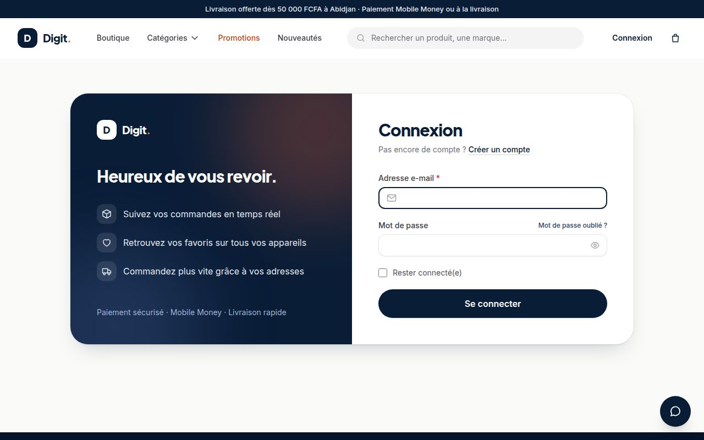

> **Sécurité :** ne communiquez jamais votre mot de passe. Pour donner accès à un employé, créez-lui son propre compte (voir [section 11](#11-clients-et-membres-de-léquipe)). Après 5 tentatives erronées, la connexion est bloquée une minute.

**Mot de passe oublié ?** Cliquez sur « Mot de passe oublié ? » sur la page de connexion : vous recevrez un lien par e-mail pour en choisir un nouveau.

**Se déconnecter :** cliquez sur vos initiales en haut à droite, puis sur **Déconnexion**.

---

## 2. Le tableau de bord

C'est votre page d'accueil. Elle résume l'activité de la boutique en un coup d'œil.

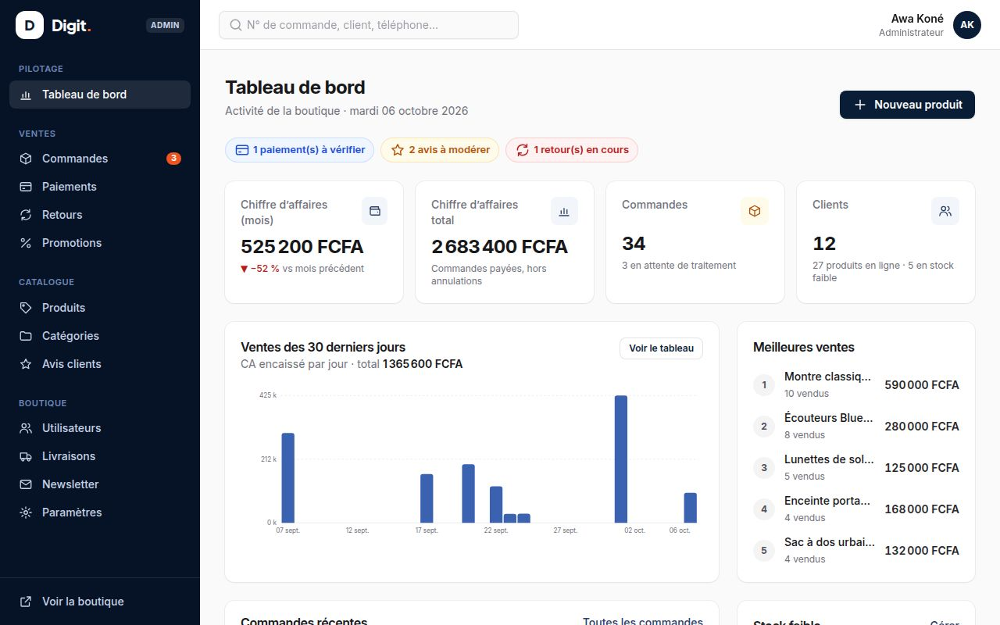

| Élément | Signification |
|---|---|
| **Chiffre d'affaires (mois)** | Total des commandes **payées** ce mois-ci, avec l'évolution par rapport au mois précédent |
| **Chiffre d'affaires total** | Total de toutes les commandes payées, hors annulations |
| **Commandes** | Nombre total de commandes. Cliquez dessus pour voir celles **en attente** de traitement |
| **Clients** | Nombre de comptes clients, de produits en ligne et de produits en stock faible |
| **Ventes des 30 derniers jours** | Une barre par jour. Passez la souris sur une barre pour voir le détail ; « Voir le tableau » affiche les chiffres |
| **Meilleures ventes** | Les produits les plus vendus |
| **Commandes récentes** | Les dernières commandes. Cliquez sur une ligne pour l'ouvrir |
| **Stock faible** | Les produits presque épuisés, à réapprovisionner |
| **Dernières activités** | Les derniers changements de statut des commandes, et qui les a faits |

Le tableau de bord **se met à jour tout seul** chaque minute tant que l'onglet est ouvert : inutile de recharger la page. À l'arrivée d'une nouvelle commande, une notification apparaît en haut à droite.

En haut de la page, des **pastilles de rappel** signalent ce qui attend une action de votre part : paiements à vérifier, avis à modérer, retours en cours.

Le **menu de gauche** donne accès à toutes les rubriques. Sur téléphone, il s'ouvre avec le bouton ☰ en haut à gauche. La **barre de recherche** en haut permet de retrouver une commande par son numéro, le nom ou le téléphone du client.

---

## 3. Organiser le catalogue : les catégories

Les catégories rangent vos produits (ex. « Mode », « Beauté »). Elles apparaissent dans le menu de la boutique et sur la page d'accueil.

**Menu : Catalogue › Catégories**

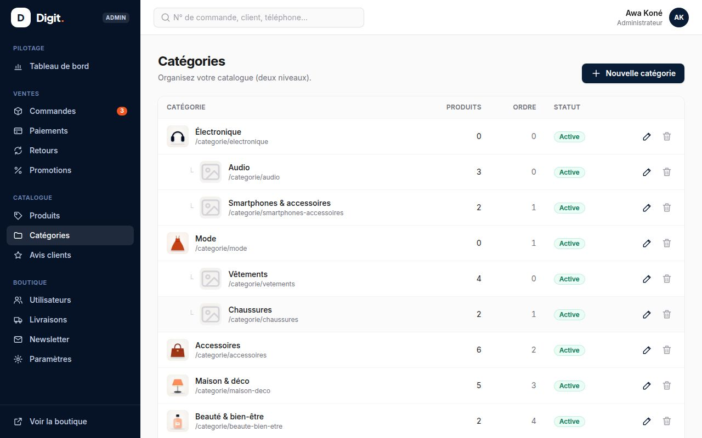

### Créer une catégorie

1. Cliquez sur **Nouvelle catégorie**.
2. Remplissez le formulaire :

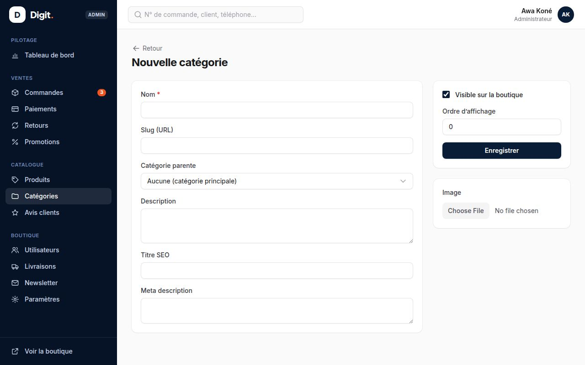

| Champ | À quoi il sert |
|---|---|
| **Nom** | Le nom affiché aux clients (ex. « Chaussures ») |
| **Slug (URL)** | La fin de l'adresse de la page (`/categorie/chaussures`). Il se remplit tout seul : inutile d'y toucher |
| **Catégorie parente** | Pour créer une sous-catégorie (ex. « Chaussures » dans « Mode »). Laissez vide pour une catégorie principale |
| **Description** | Texte affiché en haut de la page de la catégorie |
| **Titre SEO / Meta description** | Facultatif : le texte affiché par Google dans ses résultats |
| **Visible sur la boutique** | Décochez pour masquer la catégorie sans la supprimer |
| **Ordre d'affichage** | Les plus petits nombres s'affichent en premier (0, 1, 2…) |
| **Image** | Photo de la catégorie, affichée sur la page d'accueil (format paysage conseillé) |

3. Cliquez sur **Enregistrer**.

> Une catégorie qui contient des produits ou des sous-catégories ne peut pas être supprimée. Déplacez d'abord ses produits, ou décochez simplement « Visible sur la boutique ».

---

## 4. Ajouter ou modifier un produit

**Menu : Catalogue › Produits**, puis le bouton **Nouveau produit**. Pour modifier un produit existant, cliquez sur son nom dans la liste.

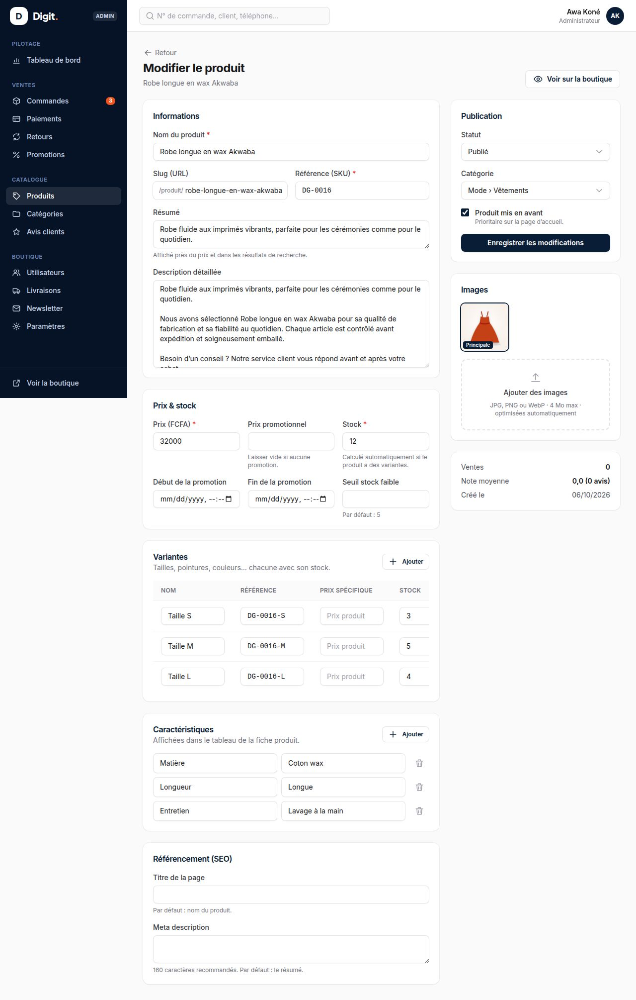

### Bloc « Informations »

| Champ | Explication |
|---|---|
| **Nom du produit** * | Le nom affiché aux clients |
| **Slug (URL)** | L'adresse de la page produit. Rempli automatiquement |
| **Référence (SKU)** * | Votre **code interne unique** pour ce produit (ex. `MOD-ROBE-014`). Il permet de distinguer deux produits proches et apparaît sur chaque commande pour savoir exactement quoi préparer. Lettres, chiffres et tirets uniquement ; il passe en majuscules tout seul. Si vous avez déjà des références (fournisseur, caisse), réutilisez-les |
| **Résumé** | 1 ou 2 phrases affichées à côté du prix |
| **Description détaillée** | Le texte complet de la fiche produit |

### Bloc « Prix & stock »

| Champ | Explication |
|---|---|
| **Prix** * | Le prix normal, en FCFA, sans espaces ni points (ex. `32000`) |
| **Prix promotionnel** | Pour une promotion : le nouveau prix, obligatoirement plus bas. Laissez vide s'il n'y a pas de promotion. Le site affiche alors l'ancien prix barré et le pourcentage de réduction |
| **Début / Fin de la promotion** | Facultatif : la promotion démarre et s'arrête automatiquement à ces dates |
| **Stock** * | Nombre d'articles disponibles. **Il diminue tout seul à chaque commande** et remonte si la commande est annulée. À 0, le produit s'affiche « Rupture de stock » et ne peut plus être commandé |
| **Seuil stock faible** | En dessous de ce nombre, le produit apparaît dans « Stock faible » et le site affiche « Plus que X en stock ». Par défaut : 5 |

### Bloc « Variantes » (tailles, pointures, couleurs…)

Utilisez ce bloc si le même produit existe en plusieurs versions.

1. Cliquez sur **Ajouter** pour chaque version.
2. Pour chacune, remplissez :
   - **Nom** : ce que le client choisit (ex. « Taille M », « Pointure 42 », « Rouge »).
   - **Référence** : par exemple celle du produit suivie de l'option (`MOD-ROBE-014-M`).
   - **Prix spécifique** : seulement si cette version a un prix différent. Sinon, laissez vide.
   - **Stock** : la quantité disponible **pour cette version**.
   - **Active** : décochez pour retirer temporairement une version.

Avec des variantes, le **stock total du produit est calculé automatiquement** (somme des variantes). Le client doit obligatoirement choisir une option avant d'ajouter au panier, et une option épuisée apparaît barrée.

### Bloc « Caractéristiques »

Un tableau affiché sur la fiche produit (ex. « Matière : coton », « Garantie : 12 mois »). Cliquez sur **Ajouter** pour chaque ligne.

### Bloc « Publication » (colonne de droite)

| Champ | Explication |
|---|---|
| **Statut** | **Publié** : visible et achetable. **Brouillon** : invisible, en préparation. **Désactivé** : retiré de la vente |
| **Catégorie** | Où le produit est rangé |
| **Produit mis en avant** | Le produit est prioritaire sur la page d'accueil |

### Bloc « Images »

1. Cliquez sur la zone **Ajouter des images** et choisissez une ou plusieurs photos (JPG, PNG ou WebP, 4 Mo maximum chacune), ou faites-les glisser depuis votre ordinateur. Un **aperçu** s'affiche aussitôt ; la croix ✕ retire une photo choisie par erreur, et une photo trop lourde est encadrée en rouge.
2. Les photos sont **automatiquement optimisées** pour que le site reste rapide.
3. La première image devient l'**image principale**, celle affichée dans le catalogue. Pour en changer, survolez une autre image et cliquez sur l'étoile ★. Pour supprimer une image, cliquez sur la corbeille.

> **Conseils photo :** des images carrées (au moins 800 × 800 pixels), sur fond clair et uni, bien éclairées. Ce sont elles qui font vendre.

### Bloc « Référencement (SEO) »

Facultatif. C'est le titre et le texte qui apparaissent dans les résultats Google. S'ils sont vides, le nom et le résumé du produit sont utilisés.

Cliquez enfin sur **Créer le produit** (ou **Enregistrer les modifications**). Le bouton **Voir sur la boutique** permet de vérifier le rendu côté client.

---

## 5. Publier, masquer, supprimer un produit et suivre le stock

**Menu : Catalogue › Produits**

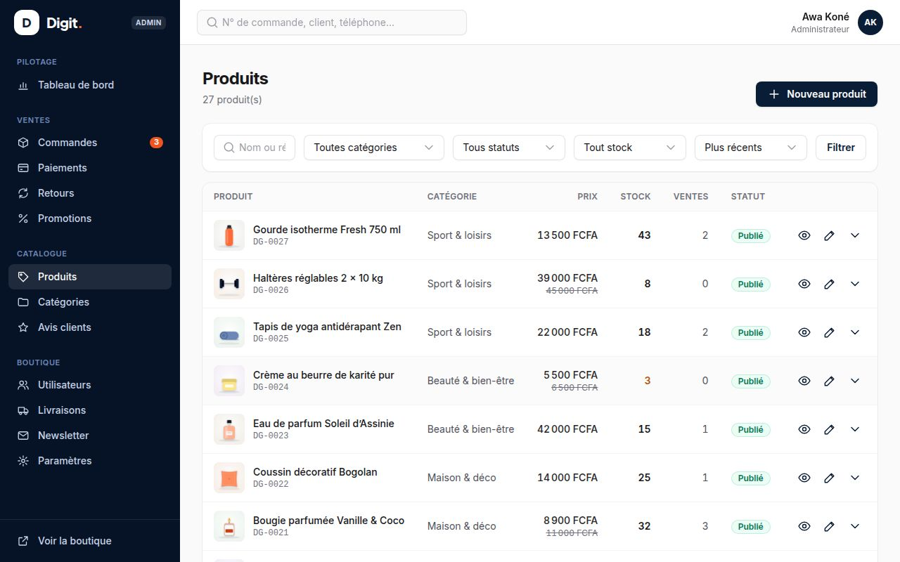

- **Rechercher :** tapez un nom ou une référence ; la liste se met à jour **pendant la frappe**, sans bouton à cliquer.
- **Filtrer :** par catégorie, statut (publié, brouillon, désactivé) ou stock (« Stock faible », « Épuisé »). Le résultat s'affiche immédiatement.
- **Trier :** cliquez sur le titre d'une colonne (Produit, Prix, Stock, Ventes) ; un second clic inverse l'ordre.
- **Corriger le stock sans ouvrir le produit :** cliquez dans la case du stock, tapez la nouvelle quantité puis **Entrée**. (Pour un produit à variantes, le stock se modifie dans la fiche produit.)
- **Publier / dépublier d'un clic :** cliquez sur le badge de statut (« Publié », « Brouillon »).
- **Actions groupées :** cochez plusieurs produits ; une barre apparaît pour les publier, les dépublier ou les désactiver ensemble.
- **Le stock** s'affiche en **orange** quand il est faible et en **rouge** à 0.

Sur chaque ligne :

- 👁 ouvre le produit sur la boutique ;
- ✏ ouvre la modification ;
- la flèche ⌄ ouvre les actions rapides.

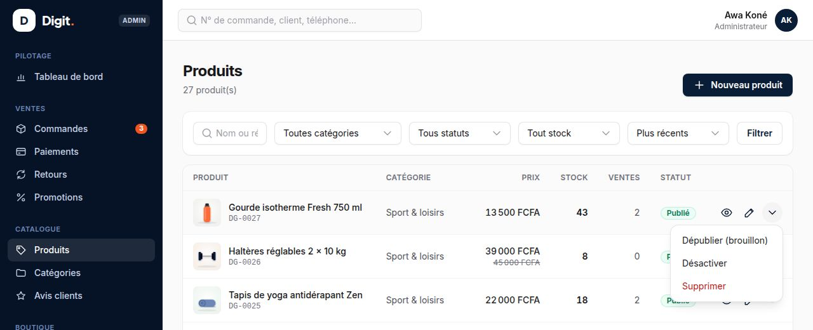

| Action | Effet |
|---|---|
| **Publier** | Le produit devient visible et achetable |
| **Dépublier (brouillon)** | Le produit disparaît de la boutique, mais vous pouvez continuer à le préparer |
| **Désactiver** | Retire le produit de la vente (ex. fin de série) |
| **Supprimer** | Retire définitivement le produit de la boutique. **Les commandes passées gardent leur historique** (nom, prix payé) |

**Réapprovisionner :** filtrez sur « Stock faible », ouvrez le produit, corrigez le **Stock** (ou le stock de chaque variante) et enregistrez.

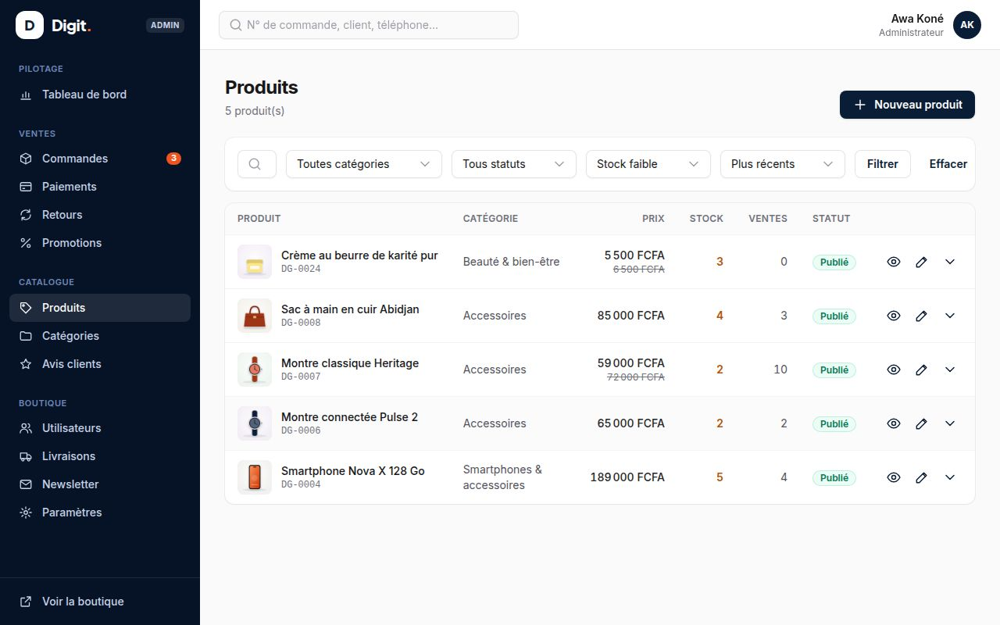

---

## 6. Traiter une commande

**Menu : Ventes › Commandes**. Le nombre en pastille indique les commandes **en attente**.

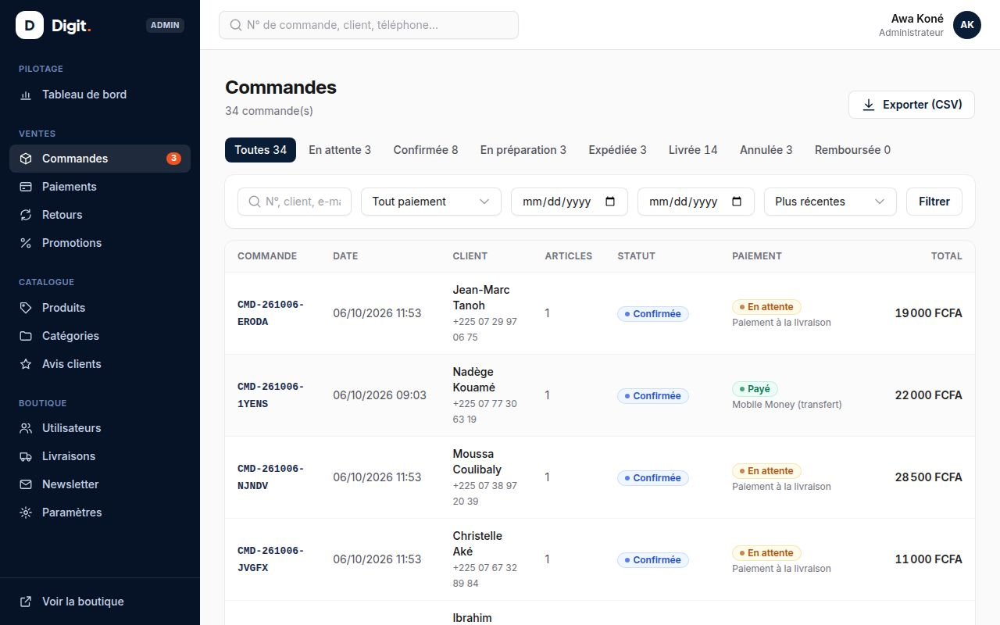

Les onglets en haut filtrent par statut. Vous pouvez aussi rechercher par numéro, nom, e-mail ou téléphone, filtrer par paiement ou par dates, et **exporter la liste en Excel (CSV)**. Tout s'applique instantanément.

La liste **se rafraîchit toute seule** toutes les 20 secondes : une nouvelle commande y apparaît avec le badge **Nouveau**, accompagnée d'une notification.

### Le parcours d'une commande

```
En attente → Confirmée → En préparation → Expédiée → Livrée
     └───────────┴──────────────┴──→ Annulée (le stock est remis en vente automatiquement)
```

| Statut | Signification | Votre action |
|---|---|---|
| **En attente** | Le client vient de commander | Vérifier la commande, appeler le client si nécessaire, puis **Confirmer** |
| **Confirmée** | Commande validée (automatiquement quand un paiement est confirmé) | Préparer les articles, puis **Passer en préparation** |
| **En préparation** | Le colis est en cours de préparation | Contacter le livreur, puis **Marquer comme expédiée** au départ du colis |
| **Expédiée** | Le colis est chez le livreur | **Marquer comme livrée** une fois remis au client |
| **Livrée** | Terminé. Le client peut laisser un avis et demander un retour sous 14 jours | — |
| **Annulée** | Commande annulée, stock remis en vente | — |
| **Remboursée** | Commande remboursée après livraison | — |

**À chaque changement de statut, le client reçoit automatiquement un e-mail** et voit l'avancement dans son espace client.

### Ouvrir une commande

Cliquez sur une commande dans la liste :

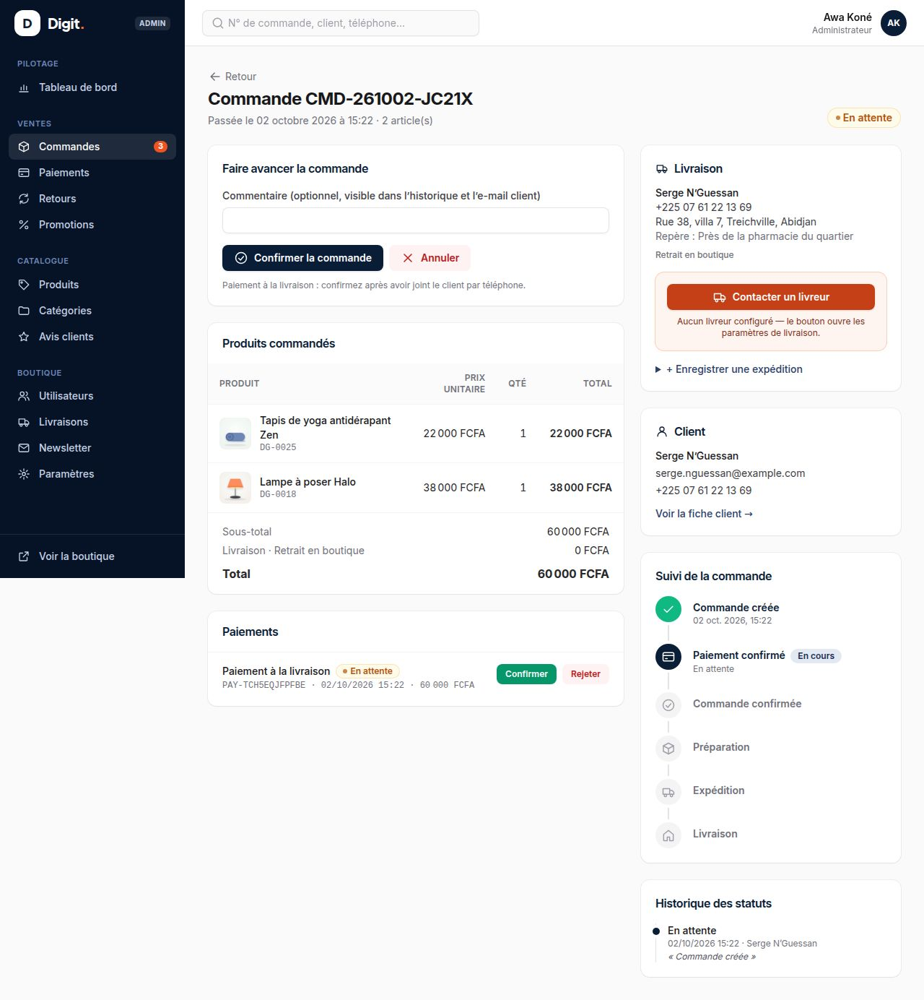

Vous y trouvez les éléments ci-dessous. Chaque action (changement de statut, confirmation d'un paiement, expédition) s'applique **sans recharger la page** : le statut, le suivi et l'historique se mettent à jour aussitôt, et un message de confirmation apparaît en haut à droite.


- **Faire avancer la commande** : les boutons proposent uniquement les étapes possibles. Le commentaire facultatif est visible par le client dans l'e-mail et l'historique.
- **Produits commandés** : avec les prix **au moment de l'achat**, la référence (SKU) et l'option choisie (taille…).
- **Paiements** : le moyen de paiement et son statut, avec les boutons **Confirmer** et **Rejeter** (voir [section 7](#7-vérifier-les-paiements)).
- **Livraison** : le nom, le téléphone (cliquable pour appeler), l'adresse et le point de repère du client.
- **Client** : ses coordonnées et un lien vers sa fiche.
- **Suivi** et **Historique** : toutes les étapes, avec la date et la personne qui les a faites.

### Contacter un livreur

Dans le bloc **Livraison**, le bouton orange **Contacter un livreur** ouvre directement la plateforme de votre livreur partenaire. Selon ce qui est configuré, vous avez aussi :

- **Écrire sur WhatsApp** : un message déjà rédigé avec le numéro de commande, le nom et le téléphone du client, l'adresse et **le montant à encaisser** ;
- **Appeler le livreur.**

> Si rien n'est configuré, le bouton vous emmène vers **Paramètres › Livraison** pour renseigner votre livreur (voir [section 13](#13-paramètres-du-site)).

**Enregistrer une expédition** (facultatif) : indiquez le nom du livreur et, si vous en avez un, le numéro de suivi. Ils seront visibles par le client.

### Cas du paiement à la livraison

1. Appelez le client pour confirmer, puis cliquez sur **Confirmer la commande**.
2. Faites avancer la commande normalement jusqu'à **Livrée**.
3. Quand le livreur vous a reversé l'argent, cliquez sur **Confirmer** dans le bloc **Paiements**. La commande est alors comptée dans votre chiffre d'affaires. *(Les boutons de paiement sont réservés aux administrateurs.)*

### Annuler une commande

Cliquez sur **Annuler** et confirmez. Le stock est automatiquement remis en vente et le client est prévenu. Une commande expédiée ne peut plus être annulée.

> Un client peut lui-même annuler sa commande depuis son espace, tant qu'elle n'est ni payée ni en préparation.

---

## 7. Vérifier les paiements

**Menu : Ventes › Paiements** — réservé aux administrateurs.

Quand un client paie par **Mobile Money (transfert)**, il envoie l'argent sur votre numéro, puis saisit sur le site l'opérateur et la **référence de transaction** reçue par SMS. Le paiement passe alors **« En cours de vérification »**.

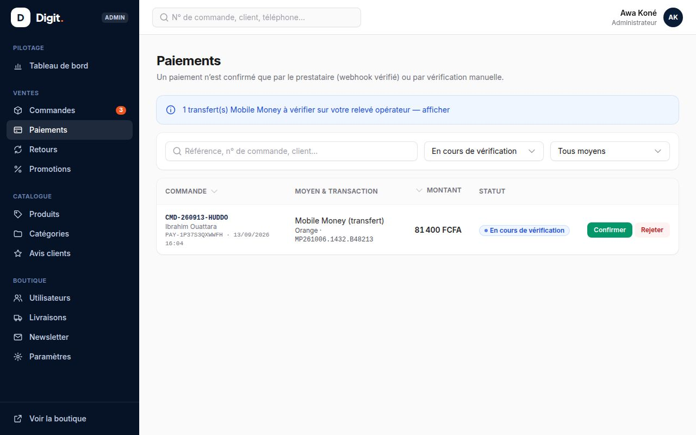

**Pour chaque paiement à vérifier :**

1. Ouvrez votre application ou votre relevé Mobile Money (Orange Money, MTN, Moov, Wave…).
2. Retrouvez la transaction grâce à la **référence**, au **montant** et aux derniers chiffres du numéro payeur.
3. Si l'argent est bien reçu, cliquez sur **Confirmer**, puis validez dans la fenêtre de confirmation. La commande passe automatiquement en **Confirmée** et le client reçoit un e-mail.
4. Si vous ne trouvez pas la transaction, ou si le montant est faux, cliquez sur **Rejeter**. Le client pourra payer à nouveau.

> **Règle de sécurité :** ne confirmez **jamais** un paiement sur la seule foi d'une capture d'écran envoyée par le client. Vérifiez toujours sur votre propre relevé.

---

## 8. Créer un code promo

**Menu : Ventes › Promotions**, puis **Nouveau code**.

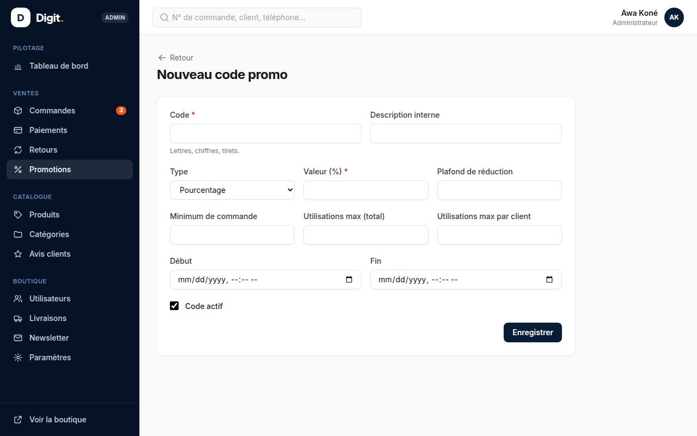

| Champ | Exemple | Explication |
|---|---|---|
| **Code** | `NOEL2026` | Ce que le client tape dans son panier |
| **Type** | Pourcentage / Montant fixe | −10 % ou −5 000 FCFA |
| **Valeur** | `10` ou `5000` | Le pourcentage, ou le montant en FCFA |
| **Plafond de réduction** | `15000` | Pour un pourcentage : la réduction maximale |
| **Minimum de commande** | `40000` | Le code ne fonctionne qu'à partir de ce montant |
| **Utilisations max (total)** | `100` | Nombre total d'utilisations, tous clients confondus |
| **Utilisations max par client** | `1` | Par exemple, un code de bienvenue utilisable une seule fois |
| **Début / Fin** | — | Période de validité |
| **Code actif** | ✔ | Décochez pour suspendre le code |

La liste des codes indique combien de fois chacun a été utilisé. Un code déjà utilisé ne peut pas être supprimé : il est simplement désactivé.

> Pour une promotion sur un produit précis (prix barré), utilisez plutôt le **prix promotionnel** dans la fiche produit (section 4).

---

## 9. Modérer les avis clients

Seuls les clients qui ont **réellement reçu** un produit peuvent le noter. Chaque avis attend votre validation avant d'être publié.

**Menu : Catalogue › Avis clients**

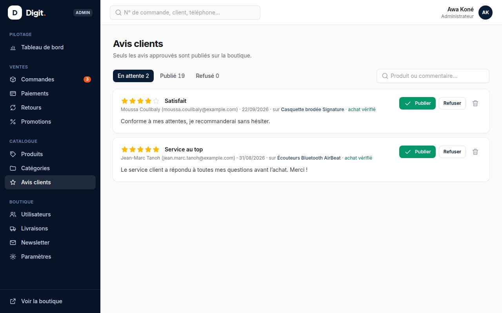

- **Publier** : l'avis apparaît sur la fiche produit et la note moyenne est recalculée.
- **Refuser** : l'avis n'est pas publié (propos injurieux, hors sujet…).
- **Corbeille** : suppression définitive (après confirmation).

L'avis traité disparaît aussitôt de la liste, sans rechargement ; les onglets en haut indiquent combien il en reste.

> Conseil : publiez aussi les avis mitigés mais honnêtes. Ils rendent la boutique plus crédible, et les meilleurs avis apparaissent sur la page d'accueil.

---

## 10. Gérer les retours et remboursements

Un client peut demander un retour depuis son espace, dans les 14 jours suivant la livraison, en indiquant un motif.

**Menu : Ventes › Retours**

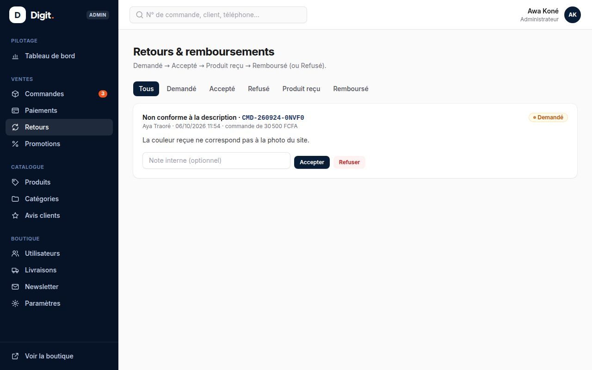

Le parcours d'un retour :

1. **Demandé** : lisez le motif, puis cliquez sur **Accepter** ou **Refuser**. Vous pouvez ajouter une note interne.
2. **Accepté** : organisez la récupération du produit. À réception, cliquez sur **Produit reçu**.
3. **Produit reçu** : remboursez le client (par Mobile Money, par exemple), indiquez le montant remboursé, puis cliquez sur **Marquer remboursé**.

> Le remboursement d'argent se fait en dehors du site (transfert Mobile Money). Le site garde la trace de la décision et du montant.

---

## 11. Clients et membres de l'équipe

**Menu : Boutique › Utilisateurs**

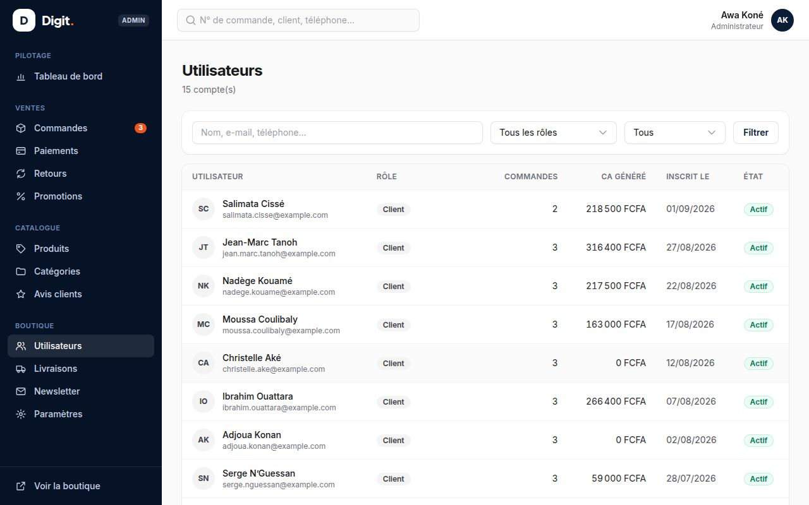

La liste montre tous les comptes, avec leur nombre de commandes et le chiffre d'affaires qu'ils ont généré. Vous pouvez rechercher et filtrer par rôle ou par état. Cliquez sur un nom pour voir sa fiche : commandes, adresses, statistiques.

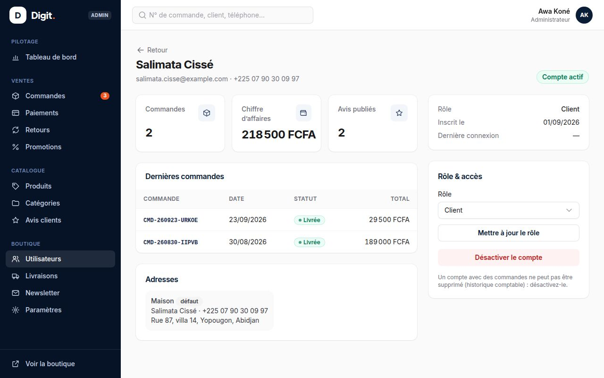

### Les rôles

| Rôle | Ce qu'il peut faire |
|---|---|
| **Client** | Acheter, suivre ses commandes. Aucun accès à l'administration |
| **Gestionnaire** | Produits, catégories, commandes, livraisons, avis, retours. Voit les clients. **Ne voit pas** les paiements, les promotions, les paramètres ni la gestion de l'équipe |
| **Administrateur** | Tout, sauf nommer un super administrateur |
| **Super administrateur** | Tout, y compris gérer les administrateurs |

### Donner accès à un employé

1. Demandez-lui de **créer un compte** sur la boutique (bouton « Connexion », puis « Créer un compte »).
2. Retrouvez-le dans **Utilisateurs**, ouvrez sa fiche.
3. Dans **Rôle & accès**, choisissez **Gestionnaire** (ou **Administrateur**), puis cliquez sur **Mettre à jour le rôle**.

### Désactiver un compte

Sur la fiche, **Désactiver le compte** déconnecte immédiatement la personne et l'empêche de se reconnecter. C'est utile au départ d'un employé, ou pour un client abusif. **Réactiver le compte** annule l'opération.

> Un compte qui a passé des commandes ne peut pas être supprimé, pour garder l'historique comptable : désactivez-le.

---

## 12. Modes et tarifs de livraison

**Menu : Boutique › Livraisons**

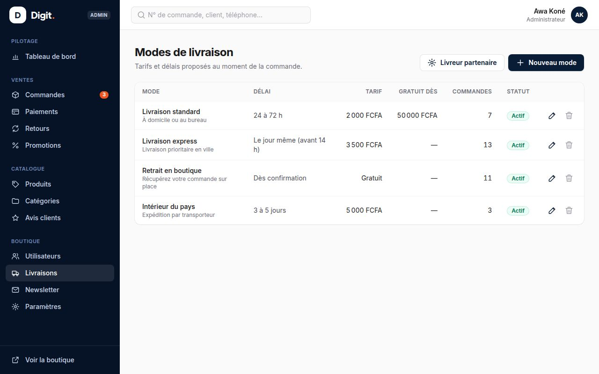

Ce sont les options proposées au client au moment de commander. Pour chacune :

- **Nom** et **description** (ex. « Livraison express », « Le jour même avant 14 h ») ;
- **Tarif** en FCFA (`0` pour gratuit, ex. « Retrait en boutique ») ;
- **Gratuit à partir de** : la livraison devient offerte au-delà de ce montant d'achat ;
- **Délai estimé**, affiché au client ;
- **Ordre d'affichage** et **Proposé aux clients**, pour activer ou masquer l'option.

---

## 13. Paramètres du site

**Menu : Boutique › Paramètres**. Les modifications sont visibles immédiatement sur le site.

### Onglet « Contact »

Le téléphone, le WhatsApp, l'e-mail, l'adresse et les horaires, affichés dans le pied de page et la page Contact.

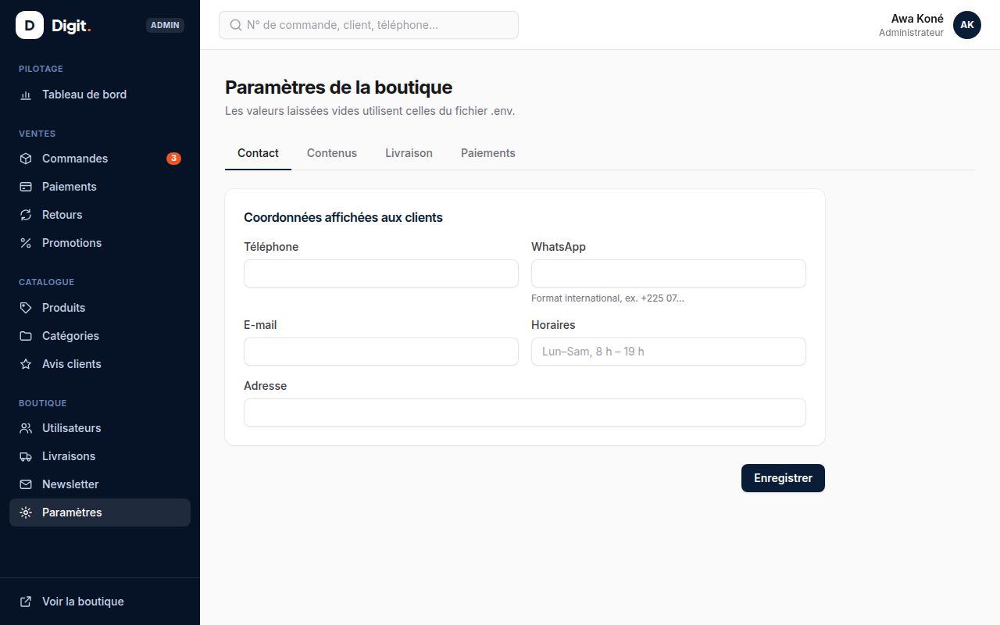

### Onglet « Contenus »

- **Bandeau d'annonce** : la bande en haut de toutes les pages (ex. « Livraison offerte dès 50 000 FCFA »). Laissez vide pour la masquer.
- **Accroche, titre et texte du hero** : la grande zone en haut de la page d'accueil.
- **Image du hero** : la grande photo de la page d'accueil. Sans image, le produit mis en avant est affiché.
- **Présentation** : le texte du pied de page.

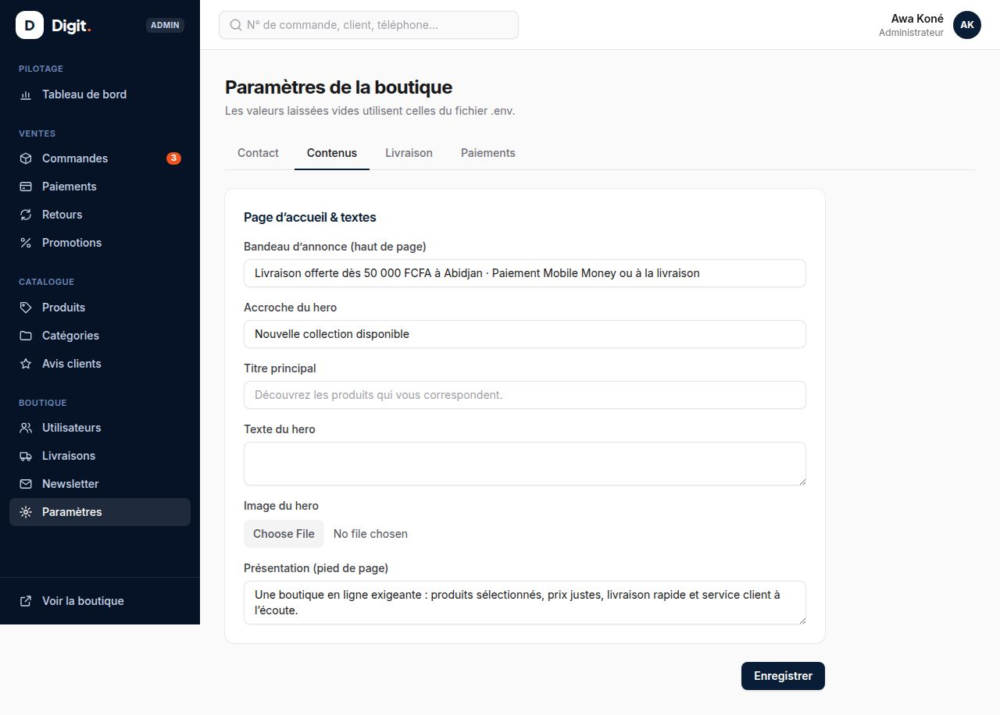

### Onglet « Livraison »

- **Votre livreur partenaire** : nom, adresse de sa plateforme, téléphone, WhatsApp et informations utiles. C'est ce qu'utilise le bouton **Contacter un livreur** de chaque commande.
- **Texte de la page « Informations de livraison »** : les zones desservies, les délais, les conditions. Les tarifs y sont ajoutés automatiquement.

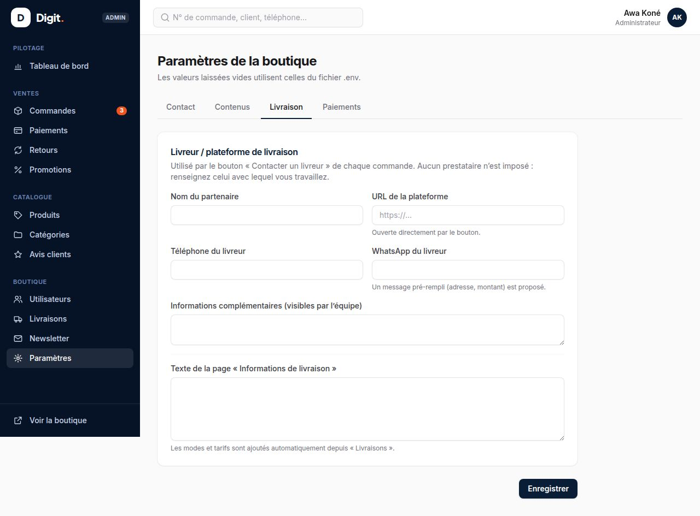

### Onglet « Paiements »

Il affiche les moyens de paiement actifs. Leur activation et les numéros Mobile Money sont réglés par votre prestataire technique, pour des raisons de sécurité.

---

## 14. Newsletter

**Menu : Boutique › Newsletter**

Elle liste les personnes inscrites depuis la page d'accueil. Le bouton **Exporter (CSV)** télécharge les adresses actives, à importer dans votre outil d'e-mailing (Brevo, Mailchimp…). Chaque inscrit peut se désinscrire en un clic.

---

## 15. Votre routine quotidienne

**Chaque matin (10 minutes) :**

1. **Tableau de bord** : regardez les pastilles de rappel en haut.
2. **Paiements** : vérifiez et confirmez les transferts Mobile Money « En cours de vérification ».
3. **Commandes › En attente** : appelez les clients si besoin, puis confirmez.
4. **Commandes › Confirmées / En préparation** : préparez les colis, puis cliquez sur **Contacter un livreur**.
5. **Commandes › Expédiées** : passez en **Livrée** les colis remis, et confirmez les paiements à la livraison encaissés.

**Chaque semaine :**

- **Stock faible** : réapprovisionnez.
- **Avis clients** et **Retours** : traitez les demandes.
- **Promotions** : vérifiez les codes actifs et leurs dates.

---

## 16. Questions fréquentes

**Mon produit n'apparaît pas sur la boutique.**
Vérifiez qu'il est en statut **Publié**, que sa catégorie est **visible**, et que son stock n'est pas à 0 (il apparaîtrait alors « Rupture de stock »).

**Un client dit ne pas avoir reçu l'e-mail de confirmation.**
Demandez-lui de regarder dans ses courriers indésirables (spam). Il peut aussi suivre sa commande dans **Mon compte › Mes commandes**. Si aucun client ne reçoit d'e-mails, prévenez votre prestataire technique.

**Un client a payé mais la commande est toujours « En attente ».**
Allez dans **Paiements** : le paiement est sûrement « En cours de vérification ». Vérifiez-le sur votre relevé, puis confirmez.

**J'ai fait une erreur de statut.**
Pour protéger votre comptabilité, une commande ne peut pas revenir en arrière. Ajoutez un commentaire au statut suivant pour l'expliquer, ou contactez votre prestataire technique en cas de vrai problème.

**Comment changer le prix d'un produit ?**
Ouvrez le produit, modifiez le **Prix** et enregistrez. Les commandes déjà passées conservent l'ancien prix.

**Un client a oublié son mot de passe.**
Il clique sur « Mot de passe oublié ? » sur la page de connexion et reçoit un lien par e-mail. Vous n'avez rien à faire.

**Puis-je gérer la boutique depuis mon téléphone ?**
Oui. Toute l'administration est utilisable sur téléphone : le menu s'ouvre avec le bouton ☰.

---

## Assistance

Pour toute question, modification du site ou problème technique, contactez votre prestataire :

- **Nom :** ………………………………………
- **Téléphone / WhatsApp :** ………………………………………
- **E-mail :** ………………………………………

*Merci de préciser, si possible, le numéro de commande concerné et une capture d'écran du problème.*
